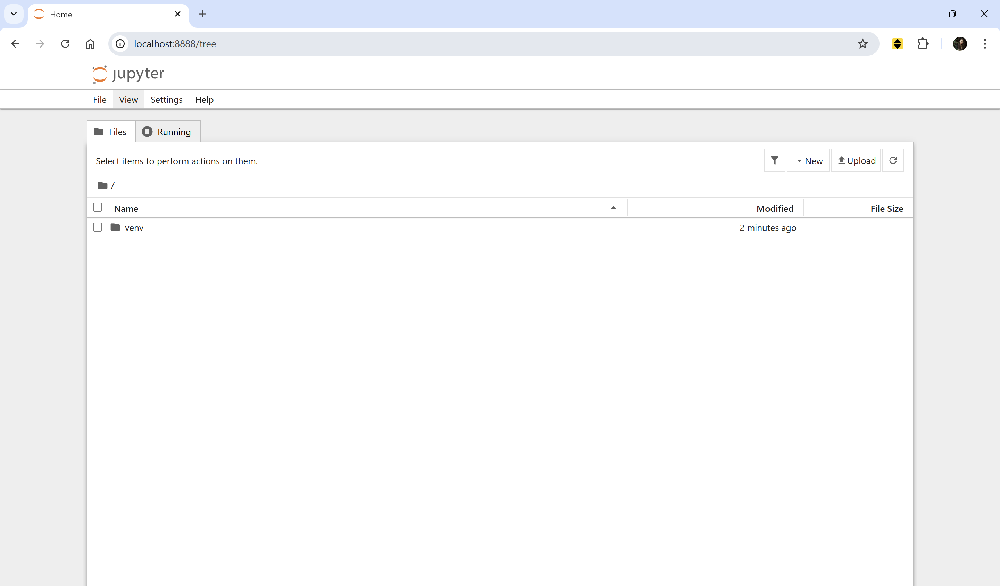
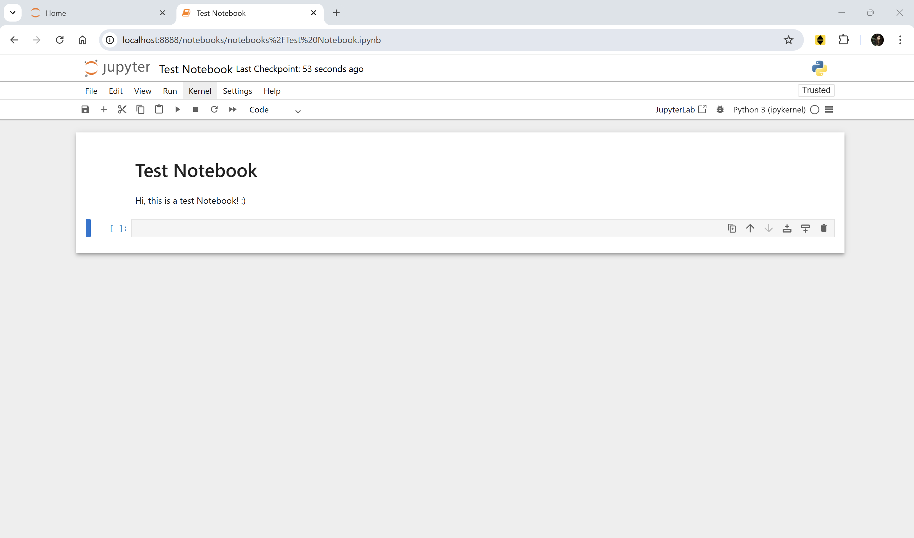

# 📒 How to start a Jupyter Notebook

Dear future me, I know you are going to forget — again — how to launch a Jupyter Notebook.  
So here's a quick guide, for you and for anyone else who stumbles upon this page.

## Step 1 — Create a project folder

Open the command prompt and create a new project folder.
Why? Because you don’t want to install packages globally and risk breaking your other projects.  
Keeping things clean is your watchword (though it clearly doesn't apply to your desk right now).

```bash
mkdir my_project
cd my_project
```

## Step 2 — Create your virtual environment

```bash
python -m venv venv
```
## Step 3 — Activate the virtual environment

On Windows:
```bash
.\venv\Scripts\activate
```
## Step 4 — Install Jupyter

```bash
pip install notebook
```
## Step 5 — Launch Jupyter Notebook
```bash
jupyter notebook
```
Or, if you prefer Jupyter Lab:
```bash
pip install jupyterlab
jupyter lab
```



## Step 6 — Create the first notebook
To keep things organized, create a new folder (e.g., `notebooks`) at the same level as `venv` folder.

1. In the Jupyter interface, click **"New" → "Folder"**
2. Rename the folder to something like `notebooks`
3. Enter the folder
4. Click **"New" → "Python 3"** to create the first notebook!




That’s it!
Good luck with your new project :)

---

P.S.
Don't forget to deactivate the environment when you're done:

```bash
deactivate
```
